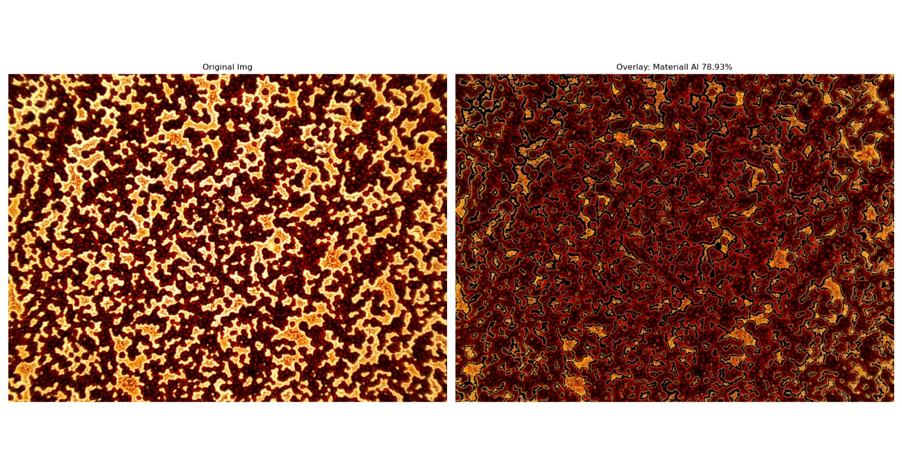

# PerovSegNet

**PerovSegNet** is a machine learning-based segmentation model designed for segmenting perovskite layers. It leverages advanced image processing techniques and clustering algorithms to provide accurate segmentation results.

## Sample Output

Here is an example of the segmentation results produced by **PerovSegNet**:



## Features
- Image segmentation for perovskite layers
- Utilizes machine learning techniques like **KMeans Clustering**
- Built with **Streamlit** for an interactive UI
- Supports real-time visualization with **Matplotlib**
- **Desktop Application** - Standalone executable for macOS and Windows

---

## Usage Options

### Option 1: Run as Web Application

#### Installation

```sh
pip install -e .
```

#### Launch

```sh
streamlit run app/main.py
```

### Option 2: Desktop Application

Build a standalone executable that doesn't require Python installation.

#### macOS (ARM64: M1/M2/M3/M4)

**Build:**
```bash
./build.sh
```

**Run:**
```bash
./dist/PerovSegNet
```

**Distribution:**
Share the `dist/PerovSegNet` file (~150 MB) with other macOS users.

#### Windows

**Build:**
```cmd
build.bat
```

**Run:**
```cmd
dist\PerovSegNet.exe
```

**Distribution:**
Share the `dist\PerovSegNet.exe` file (~150 MB) with other Windows users.

#### How It Works

The application will:
- Start automatically
- Open your browser to `http://localhost:8080`
- Run without requiring Python or any dependencies

---

## Dependencies

- `numpy`
- `opencv-python`
- `matplotlib`
- `scikit-learn`
- `streamlit`
- `pyinstaller` (for desktop builds)

## Desktop Build Files

- `build.sh` - Automated build script (macOS/Linux)
- `build.bat` - Automated build script (Windows)
- `run_app.py` - Desktop application launcher
- `PerovSegNet.spec` - PyInstaller configuration

---

## License

This project is licensed under the MIT License.

## Contact

For any inquiries or issues, please reach out via GitHub or open an issue in the repository.
